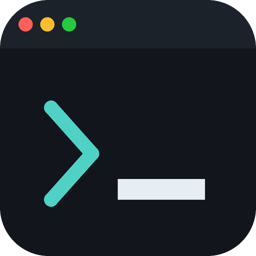

<h1 align="center">
 <br>
otacli
</h1>

<p align="center">
Watch anime from your terminal.
</p>

<p align="center">
<a href="LICENSE"></a>


</p>

<p align="center">
  
</p>

---

> **otacli is an independent project derived from [doccli](https://github.com/TowarzyszFatCat/doccli)
> by [@TowarzyszFatCat](https://github.com/TowarzyszFatCat), used under GPL-3.0.**
>
> It is **not** affiliated with, endorsed by, or supported by the doccli project.
> Please report otacli issues [here](https://github.com/SophanaSok/otacli/issues) — not upstream,
> and not on their Discord. See [`COPYRIGHT`](COPYRIGHT) for full attribution and
> [`CHANGELOG.md`](CHANGELOG.md) for what differs.

---

## What it does

otacli finds anime episodes from public sources, plays them in [mpv](https://mpv.io) without
leaving your terminal, and keeps track of what you have watched.

- Search, browse trending, and a premiere calendar
- Watch list, watch history, and resume-where-you-left-off
- Next/previous episode navigation
- Cover art previews and synopses rendered in the terminal
- Full-season downloads, an offline library, and auto-play
- AniList integration — progress sync, ratings, and two-way "Plan to Watch" sync *(needs setup, see below)*
- New-episode notifications
- Watch statistics and ranks

**A note on the catalogue.** otacli's interface is English, but its sources are Polish sites —
[docchi.pl](https://docchi.pl) and [anidb.app](https://anidb.app). Expect Polish subs and dubs
alongside English ones. If you want an English-only catalogue, [ani-cli](https://github.com/pystardust/ani-cli)
is the better tool.

## Requirements

| Package | Why |
|---|---|
| `mpv` | playback |
| `yt-dlp` | resolving stream URLs |
| `python3.12+` | with `pip` and `venv` |
| `chafa` | cover art in the terminal |
| `megatools` | *optional* — mega.nz sources |

## Install

### Linux

```bash
git clone https://github.com/SophanaSok/otacli.git && bash otacli/install.sh
```

The installer pulls system packages via `pacman`, `apt-get` or `dnf`, installs the latest
`yt-dlp`, copies the program to `~/.otacli_src`, and puts `otacli` on your `PATH`.

Then run:

```bash
otacli
```

**Update:**

```bash
cd ~ && rm -rf otacli && git clone https://github.com/SophanaSok/otacli.git && bash otacli/install.sh
```

**Uninstall:**

```bash
sudo rm /usr/local/bin/otacli && rm -rf ~/.otacli_src
```

Your list and history live in `~/.config/otacli/` and are left alone by the uninstall.
Remove that directory too if you want a clean slate.

### Windows

No installer is published yet — `installer.iss` (Inno Setup) is in the repository but is
currently untested for this project. Until a release exists, run from source:

```bat
git clone https://github.com/SophanaSok/otacli.git
cd otacli
setup_env.bat
run.bat
```

You will need `mpv`, `yt-dlp` and `chafa` on your `PATH`.

> [!TIP]
> Use [Windows Terminal](https://apps.microsoft.com/store/detail/windows-terminal/9N0DX20HK701)
> rather than the classic Console Host. Cover art renders properly, colors work, and the menu
> icons display. `winget install Microsoft.WindowsTerminal`, then set it as the default terminal
> application under *Settings → Startup*.

### Coming from doccli?

They install side by side — different command, different config directory. On first run otacli
copies your list, history and resume position across from `~/.config/doccli` (the files are
copied, not moved, so doccli keeps working). Your AniList token is **not** copied: it was issued
to doccli's API client, and otacli uses its own.

## AniList setup

otacli ships without an AniList API client, because a client ID identifies the application it
was registered for. To enable progress sync, ratings and list sync, register your own:

1. Go to [AniList → Settings → Developer](https://anilist.co/settings/developer) and create a new client.
2. Set the redirect URL to `https://anilist.co/api/v2/oauth/pin`.
3. Put the numeric client ID into `ANILIST_CLIENT_ID` in `src/main_module.py`.
4. Restart otacli and connect your account from *Settings → AniList*.

Everything except AniList sync works without this.

## Contributing

Issues and pull requests are welcome at
[github.com/SophanaSok/otacli](https://github.com/SophanaSok/otacli/issues).

[`DEVELOPMENT.md`](DEVELOPMENT.md) has the architecture map, the release process, the
sharp edges worth knowing before changing a menu, and the current list of open work.

If a bug also reproduces in doccli, it is worth reporting
[upstream](https://github.com/TowarzyszFatCat/doccli/issues) as well — they are the larger
project and fixes there help more people.

## License

GPL-3.0. See [`LICENSE`](LICENSE), and [`COPYRIGHT`](COPYRIGHT) for attribution of the original
work. Because otacli is a GPL-3.0 derivative, any fork or redistribution of it must also be
GPL-3.0.

## Disclaimer

otacli accesses publicly available content hosted by third parties. It does not host, store or
distribute any content itself. Read [`DISCLAIMER.md`](DISCLAIMER.md) before using it.

---

### Built on

[mpv](https://github.com/mpv-player/mpv) · [yt-dlp](https://github.com/yt-dlp/yt-dlp) · [chafa](https://hpjansson.org/chafa/) · [AniList API](https://anilist.gitbook.io/anilist-apiv2-docs) · [aniskip](https://api.aniskip.com/api-docs)

### Derived from

[doccli](https://github.com/TowarzyszFatCat/doccli) by TowarzyszFatCat, which was itself inspired by [ani-cli](https://github.com/pystardust/ani-cli).
